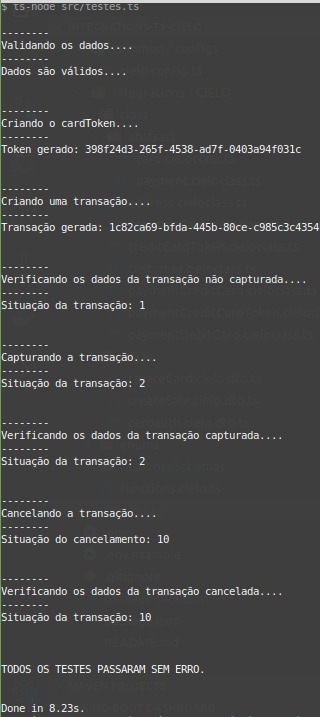

# INTEGRAÇÃO REST COM A API E-COMMERCE DA CIELO

Com esta biblioteca typescript podemos:

> 1: Validar dados de cartões

> 2:  Cadastrar cartões na API da Cielo, obtendo tokens seguros para serem armazenados e usados no lugar do número do cartão

> 3: Criar transaçoes com ou sem captura automática (Vendas!).

> 4: Capturar transações

> 5: Cancelar (estornar) transações

exemplos de uso estão no arquivo src/testes.ts, para rodar esses testes, execute:

```
npm start
```

resultado:



## Configuração

Copie o arquivo .env.example e renomeie para apenas .env, e então, configure suas credenciais e URLs de produção lá dentro.