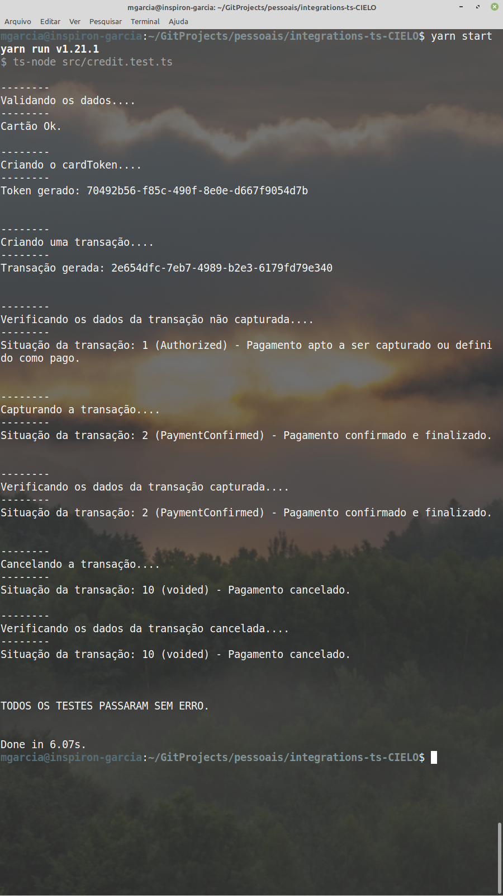
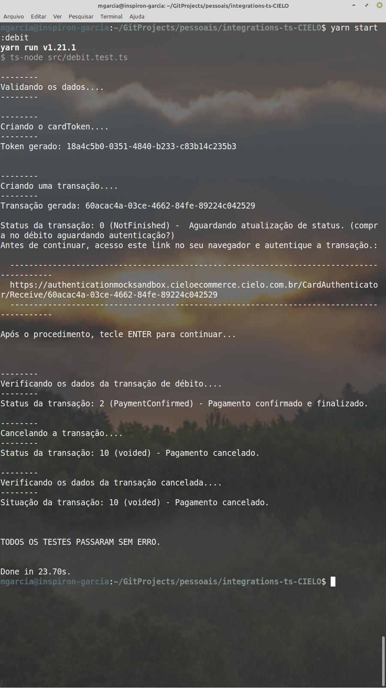

# INTEGRAÇÃO REST COM A API E-COMMERCE DA CIELO

Com esta biblioteca typescript podemos:

> 1: Validar dados de cartões

> 2:  Cadastrar cartões na API da Cielo, obtendo tokens seguros para serem armazenados e usados no lugar do número do cartão

> 3: Criar transaçoes com ou sem captura automática (Vendas!).

> 4: Capturar transações

> 5: Cancelar (estornar) transações

exemplos de uso estão nos arquivos src/credit.test.ts e src/debit.test.ts

### Executar os testes

Testar pagamento com cartão de crédito tokenizado:

```
npm start
```

resultado:




Testar pagamento com cartão de débito tokenizado:

```
npm run start:debit
```

resultado:



## Configuração

Copie o arquivo .env.example e renomeie para apenas .env, e então, configure suas credenciais e URLs de sandbox ou produção lá dentro.


## Documentação

Para cadastrar uma conta gratuita e obter as credenciais para testar a api da cielo via sandbox ( é bem rápido ):

https://cadastrosandbox.cieloecommerce.cielo.com.br/


Documentação da cielo:

https://developercielo.github.io/manual/cielo-ecommerce

